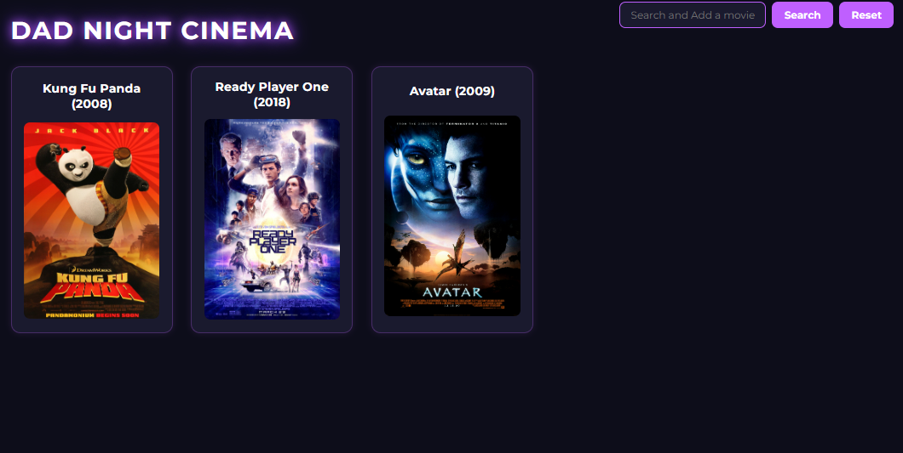
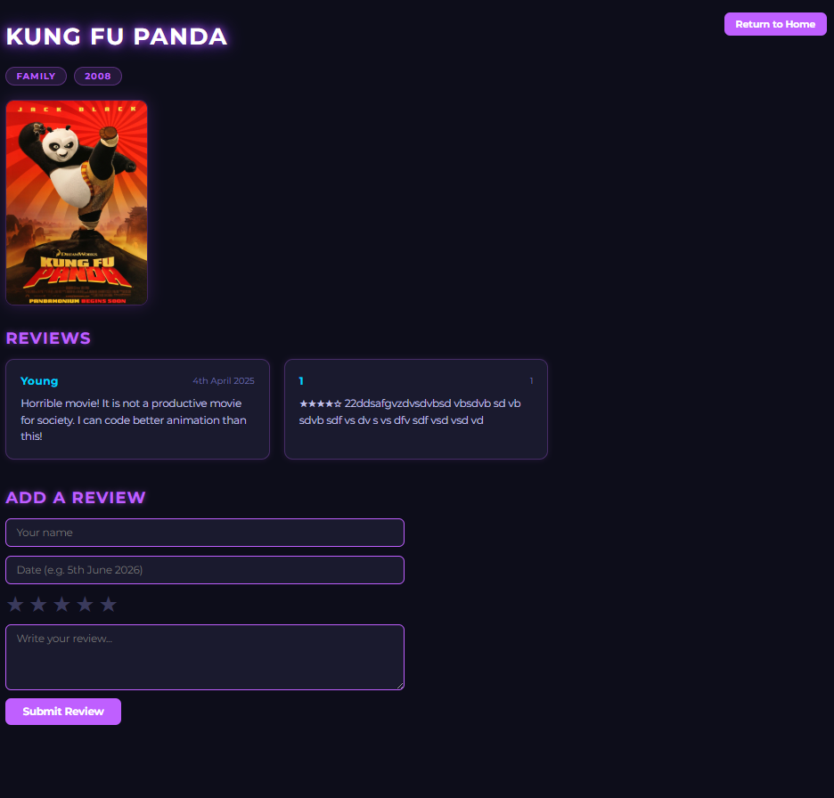
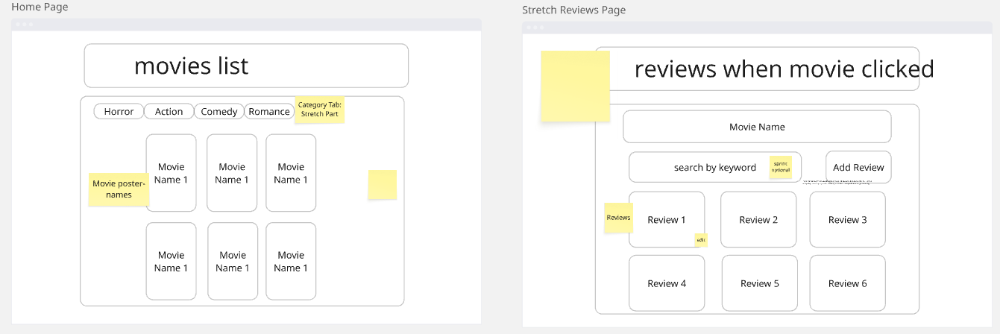

# Dad Night Cinema 🎬

A full-stack movie review app — browse a catalogue of films, open a film to see
its details, and read or write reviews. Built as a group project during Dev
Academy Aotearoa's bootcamp (week 5) by a team of three, across roughly 8
working hours over two days (incl. planning phase).

We had just learnt to implement databases that week, so we were tasked with using
a database within a full-stack app/website. The guidelines were that the MVP be
as simple as possible, the database be no more than 2 tables, and that we
establish the models as early as possible. Our plan was to establish the
wireframe, then the models, then complete the database and server setup before
attending to the client side.

We chose this idea as it was the least creative and most simple format, allowing
us to focus on working with the database and making a simple, functioning MVP
rather than overcomplicating the idea and project — ensuring we focused on the
task being completed first.




👥 **Team:** Henry Nguyen · Young Ryou · Maneet Singh

---

## Learning outcomes & my role

My learning outcomes going into this project were:

1. To develop a comprehensive understanding and mental model of the big picture
   connecting all four parts of the full stack.
2. To develop a degree of proficiency in database and server functions.

**My role as git keeper** — I reviewed and merged the team's pull requests into `main`, keeping the
branch history clean and the build integrable. I also helped keep members informed of best git 
branch management practices, and how to keep work updated after new merged PRs.

---

## My contributions

The tickets assigned to me, which I completed, were largely all server-side work:

- The server seed file
- The server model interface
- Server setup and initial routing
- Routing with a call to a DB function

At the end I also added a review system for the posts; this one was done by Claude
rather than by me, due to time constraints. Any other pieces in the commit history
under my name were likewise done by, or assisted by, Claude.

> To be transparent about it: the server-side tickets above are the work I did and
> understand at a working level; the review system and the remaining pieces were
> AI-assisted (Claude) under time pressure.

---

## Tech stack

React · TypeScript · Vite · React Router · TanStack Query · Express · Knex ·
SQLite · Sass

## Running locally

```bash
git clone git@github.com:maneet-singh-6/MovieReview.git
cd MovieReview
npm install
npm run knex migrate:latest
npm run knex seed:run
npm run dev
```

The client runs on [http://localhost:5173](http://localhost:5173) and the server
on [http://localhost:3000](http://localhost:3000).

## Team

Built with **Henry Nguyen** and **Young Ryou**.

## Planning & design (Miro Board)

